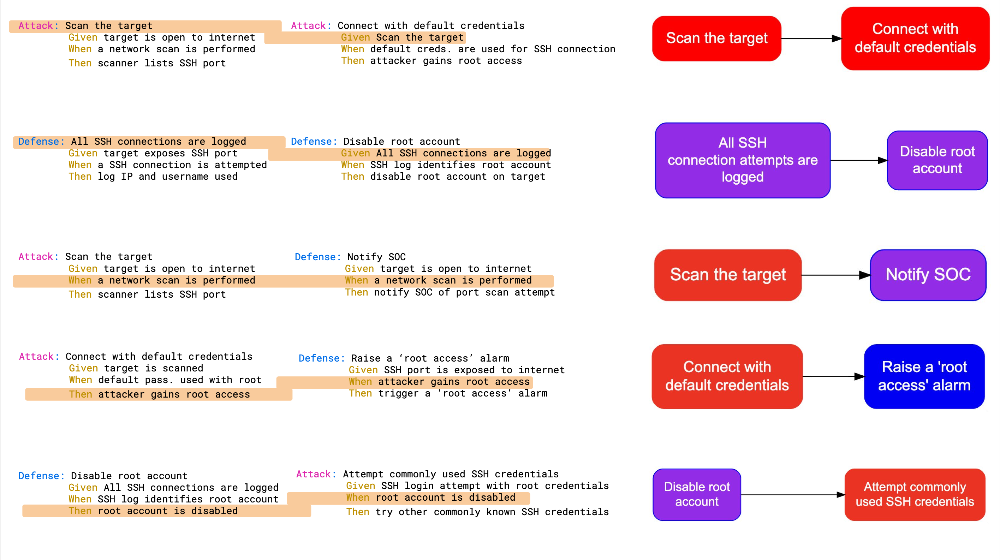

# Attack-Defense Modeling CLI tool

This is a CLI tool to process `.adm` files witten as per attack-defense model [language specifications](doc/LANGUAGE.md).

This tool can

1. Correlate attacks and defenses using `when` and `then` clauses.
1. Create decision tree graphs as graphviz `dot` files.
1. Export attacks as gauntlt files for use in automated penetration testing.
1. Export defenses as gherkin files for use in test automation tools like cucumber.

You can also use the quick reference card below to understand how attacks and defenses can be connected. Highlighted lines indicate the clauses that must match for attacks/defenses to be connected.


## Building from source

Run `make build` in the directory where the code was cloned. This will create a `adm` binary in `bin` directory.

## Usage

***NOTE**: You can use ADM files in `tests/examples/` to experiment with commands shown in this section.*

If no path is specified, `adm` will print a quick help showing all the subcommands and associated flags.

### `stat` sub-command

1. Without a flag - `adm stat [path to directory/file]`, will print titles of attacks and defenses across all files.
1. Following flags can be used to filter output -
    * `-a` - Only show attacks. For example output of `./bin/adm stat -a tests/examples/oauth/secrets-keys.adm` will be

      ```text
      MODEL: Client secrets and keys
      ==============================
              ATTACK: Secrets extracted via encoded path in URL sent to Apache Web Server
              ATTACK: Compromize web server
              ATTACK: Secrets extracted from code
              ATTACK: Secrets extracted from app binary
              ATTACK: Secrets extracted via path traversal
              ATTACK: Secrets extracted via web-server path traversal
              ATTACK: Secrets extracted via encoded path in URL
      ==============================
      ```

    * `-d` - Show both pre-emptive defenses and incident responses. For example output of `./bin/adm stat -a tests/examples/oauth/secrets-keys.adm` will be

      ```text
      MODEL: Client secrets and keys
      ==============================
              DEFENSE: Don't publish app binary containing secrets
              DEFENSE: Don't store secrets in config file
              DEFENSE: use Apache Web Server v2.5.51 or later
              DEFENSE: Don't allow path traversal to configuration files
              DEFENSE: Store secrets and keys in vault
              DEFENSE: Don't publish code containing secrets
              DEFENSE: Block encoded paths
              DEFENSE: Web-server shouldn't serve config files
              DEFENSE: Encrypt secrets before storing in file
      ==============================
      ```

    * `-p` - Only shows pre-emptive defenses.
    * `-i` - Only show incident responses.

### `graph` sub-command

This subcommand exports the entire model as a graphviz(dot) file. For example, `adm graph tests/examples/oauth/` will generate a graph with all models read from the `oauth` directory and its subdirectories. You can use this with the `dot` CLI tool to generate images, or with other tools that accept graphviz code for graph analysis. Using `-o` flag, you can redirect output to a different graphviz file - `adm graph -o tests/examples/oauth/oauth.dot tests/examples/oauth`.

### `export` sub-command

This subcommand exports ADM content into other formats - `adm export tests/examples/oauth/secrets-keys.adm`.

1. Attacks are exported into `.attack` files. These can be used with tools like `gauntlt` to automate penetration testing.
1. All defenses, including policies, are exported as `.feature` files. These can be used with TDD / BDD tools to automate application testing.

**Flags**:

1. Use `-o` to specify output location. All files will be written into a `export` directory under that location. If not specified, the *export* directory is created in the same location as the input ADM file(s).
1. To export only attacks use the `-a` flag. Similarly to export defenses only, use `-d`. Example - `adm export -d -o ~/projects/oauth/ tests/examples/oauth/`

## Note on docstrings

ADM includes support for docstrings. When writing your model, you can add code to docstrings and use export subcommand to push them into attack and feature files. It also supports specifying content type at the beginning of the docstring block. Example -

```text
Defense: Input Sanitization
  When SQL queries are prepared using input fields
  Then Input is scanned for harmful symbols
  """go
    func getHarmfulSymbols(input string) (symbols []string) {
      // detection code goes here
    }
  """
  And detected symbols are replaced by their escape-sequences
  """go
    func disableHarmfulSymbols(input string, symbols []string) error {
      // replacement logic goes here
    }
  """
```

## Additional Reading

* [The inspiration for this tool](https://swagitda.com/blog/posts/security-decision-trees-with-graphviz/)
* [Gherkin Reference](https://cucumber.io/docs/gherkin/reference/)
